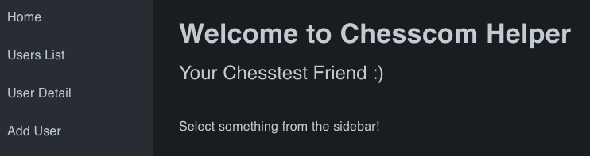
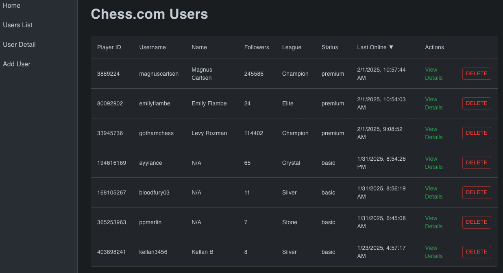
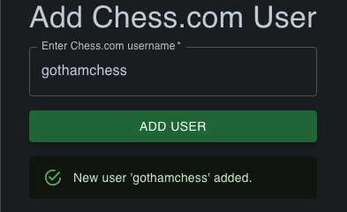
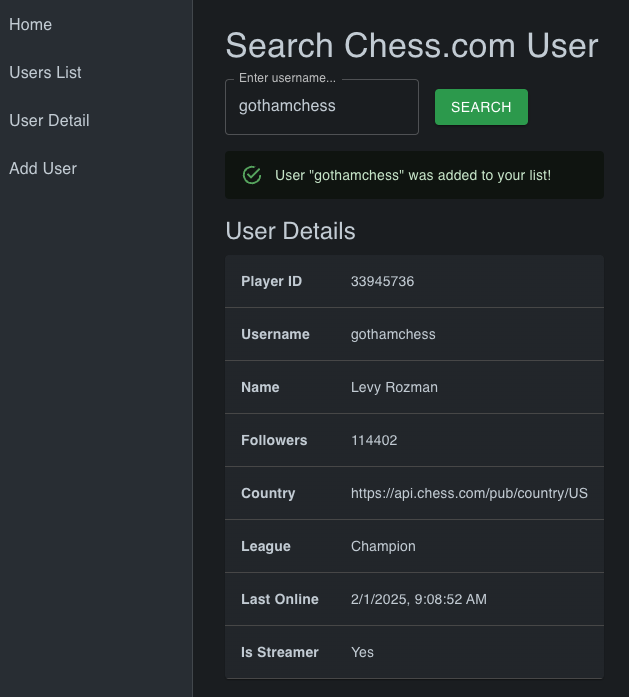

# Chesscom Helper

https://chesscomhelper.com

A lightweight web application for adding and removing Chess.com users from a display list, powered by the [Chess.com public API](https://www.chess.com/news/view/published-data-api).

(The goal of this project is to add features that are actually useful, like subscribing to notifications about a user's activity - but we aint there yet.)

## Overview

This project provides a simple way to manage and view basic information about Chess.com users:

Backend: A Django (Python) application that fetches data from the Chess.com API and stores a list of tracked users.

Frontend: React application enhanced with Vite, using Material-UI for styling, React Router for navigation, and Axios for communication with the Django backend.

## Getting Started

### Prerequisites

Rename the provided env.example file to .env to ensure the necessary environment variables are in place:

```bash
cp env.example .env
```
Build and start the containers:

```bash
make build
make up
```

### Interacting with the API

Once your containers are running, you can use curl (or any REST client) to interact with the API. For example, to add a user:

```bash
curl -X POST http://localhost:8000/api/chesscom-app/add-user/ \
     -H "Content-Type: application/json" \
     -d '{"username": "magnuscarlsen"}'
```

You can similarly remove a user with a corresponding `/remove-user/` endpoint, supplying the username in the request body.

## Frontend

To run the frontend:

```bash
make web
cd frontend
npm install
npm run dev
```

The development server should start on http://localhost:5173.

## Cross-platform Docker builds

In order to build a docker image that is compatible with any platform that supports the official Python image - such as, for _instance_, an EC2 instance running AMD - you can use the following commands:

```bash
docker buildx create --use --name mybuilder
docker buildx inspect --bootstrap
docker buildx build --platform linux/amd64,linux/arm64 -t emilycogsdill/chesscom-helper:latest --push .
```


## Running from docker image pulled from docker hub

If you want to be lazy and run this from a docker image pulled from docker hub, you'll need to set up the database before running the container. These commands assume you have an .env file where you are running them:

```bash
docker network create chesscom-net

docker run -d --name chesscom_db --network chesscom-net \
  -e POSTGRES_DB=chesscom_db \
  -e POSTGRES_USER=postgres \
  -e POSTGRES_PASSWORD=hunter2 \
  -p 5432:5432 \
  postgres:15

docker run -d --network chesscom-net --name chesscom_backend \
  -p 8000:8000 -p 5173:5173 --env-file .env emilycogsdill/chesscom-helper:latest
```


## Screenshots

Don't want to actually run the thing yourself? That's fine, this is what it all looks like:

<details>
<summary>Click to expand</summary>









</details>
