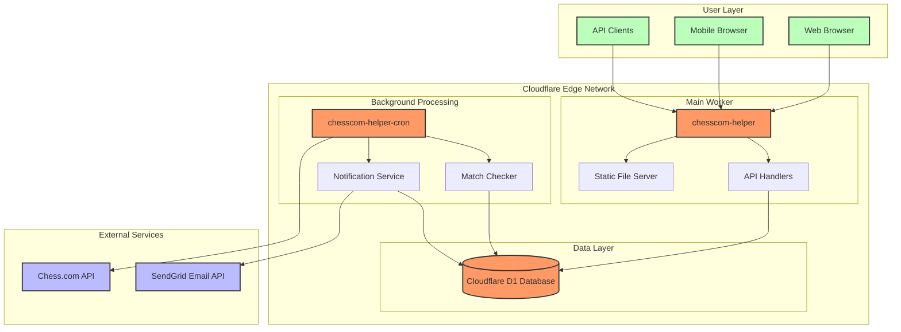
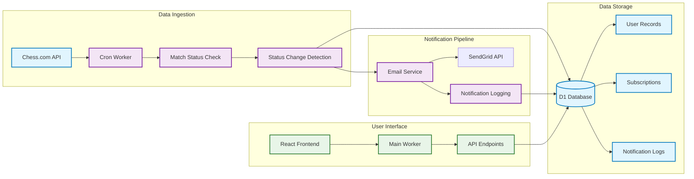
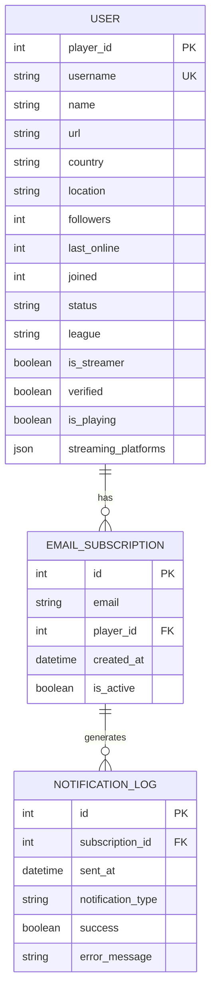
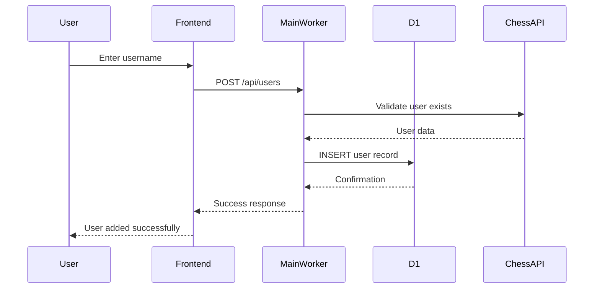
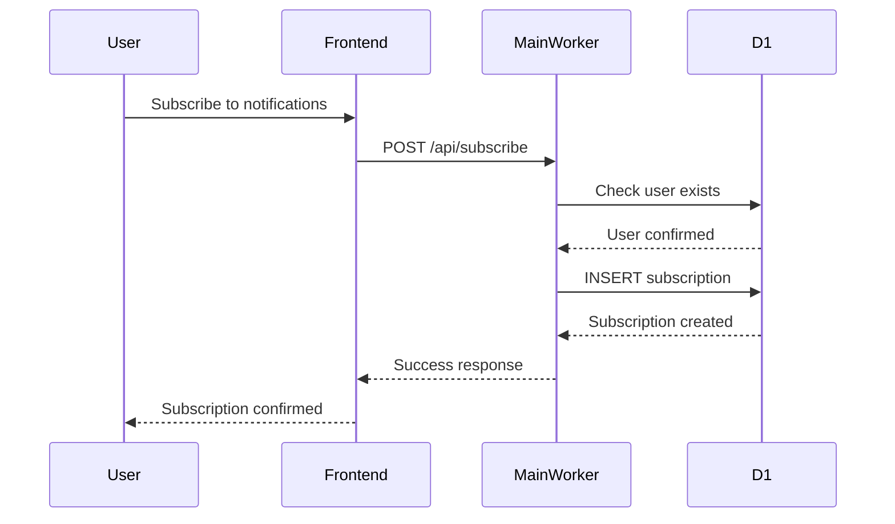
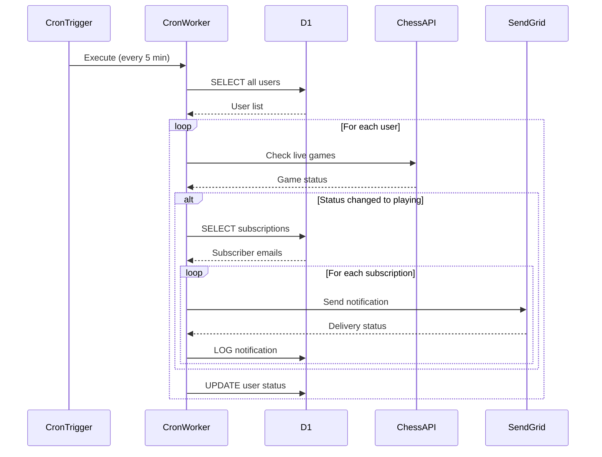
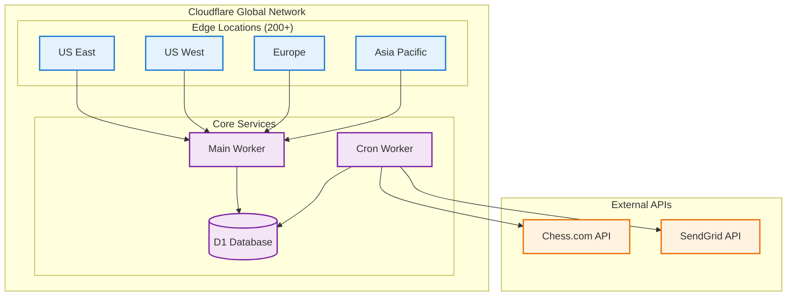
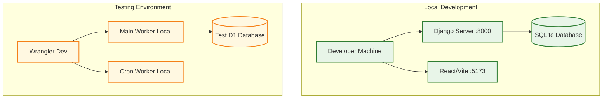

# Chess.com Helper Architecture

This document provides a comprehensive overview of the Chess.com Helper application architecture, focusing on the current Cloudflare D1-based implementation.

## Table of Contents

- [Overview](#overview)
- [Architecture Diagrams](#architecture-diagrams)
- [Component Details](#component-details)
- [Data Flow](#data-flow)
- [Technology Stack](#technology-stack)
- [Deployment Architecture](#deployment-architecture)
- [Security Model](#security-model)
- [Performance Characteristics](#performance-characteristics)
- [Migration History](#migration-history)

## Overview

Chess.com Helper is a web application that tracks Chess.com players and sends email notifications when they start live matches. The architecture has evolved from a traditional Django + PostgreSQL stack to a modern serverless architecture using Cloudflare Workers and D1 database.

### Key Benefits of Current Architecture

- **Single Cloud Provider**: Simplified infrastructure management
- **Global Distribution**: Edge computing with worldwide availability
- **Direct Database Access**: No HTTP bridge required for database operations
- **Automatic Scaling**: Serverless scaling based on demand
- **Cost Optimization**: Pay-per-use pricing model
- **High Availability**: Built-in redundancy and failover

## Architecture Diagrams

### High-Level System Architecture



### Data Flow Architecture



### Database Schema Architecture



## Component Details

### Main Worker (chesscom-helper)

**Purpose**: Serves the React frontend and handles API requests

**Key Responsibilities**:
- Static file serving for React application
- API endpoint handling (REST interface)
- Direct D1 database operations
- CORS management
- Request routing and validation

**Technologies**:
- Cloudflare Workers runtime
- Itty Router for request routing
- Direct D1 bindings for database access

**Performance Characteristics**:
- Cold start: ~50ms
- Warm request: ~5-20ms
- Memory usage: ~10-30MB
- CPU time: ~1-10ms per request

### Cron Worker (chesscom-helper-cron)

**Purpose**: Background processing for live match detection and notifications

**Key Responsibilities**:
- Periodic Chess.com API polling (every 5 minutes)
- Live match status detection
- Email notification triggering
- Notification logging and error handling

**Technologies**:
- Cloudflare Workers runtime with cron triggers
- Chess.com Public API integration
- SendGrid email service integration
- Direct D1 database operations

**Performance Characteristics**:
- Execution frequency: Every 5 minutes
- Average execution time: 30-120 seconds
- API calls per execution: ~50-200 (based on user count)
- Memory usage: ~20-50MB

### Cloudflare D1 Database

**Purpose**: Primary data storage for all application data

**Key Features**:
- SQLite-based with global distribution
- Automatic replication across Cloudflare edge locations
- Direct binding access from Workers
- ACID compliance with eventual consistency

**Schema Design**:
- **Users Table**: Chess.com player information
- **Email Subscriptions**: User notification preferences
- **Notification Logs**: Audit trail for all notifications

**Performance Characteristics**:
- Read latency: ~1-5ms (edge cached)
- Write latency: ~10-50ms (global replication)
- Throughput: 1000+ queries/second
- Storage limit: 500MB (can be increased)

## Data Flow

### User Registration Flow



### Email Subscription Flow



### Live Match Detection Flow



## Technology Stack

### Runtime Environment
- **Cloudflare Workers**: V8 isolate-based serverless compute
- **Wrangler CLI**: Development and deployment tooling

### Frontend
- **React**: UI framework
- **Vite**: Build tool and development server
- **Material-UI**: Component library
- **JavaScript/TypeScript**: Programming languages

### Backend
- **Cloudflare Workers**: Serverless backend runtime
- **Itty Router**: Lightweight routing library
- **Cloudflare D1**: SQLite-based serverless database

### External Integrations
- **Chess.com Public API**: Player data and live game status
- **SendGrid**: Email delivery service

### Development Tools
- **Git**: Version control
- **GitHub Actions**: CI/CD pipeline (when configured)
- **Poetry**: Python dependency management (for local dev)
- **npm**: Node.js package management

## Deployment Architecture

### Production Environment



### Development Environment



## Security Model

### Authentication & Authorization
- **API Access**: No authentication required for public endpoints
- **Admin Access**: Cloudflare dashboard authentication
- **Database Access**: Worker-level isolation and binding permissions

### Data Protection
- **Encryption in Transit**: TLS 1.3 for all external communications
- **Encryption at Rest**: Cloudflare D1 automatic encryption
- **API Keys**: Stored as Cloudflare Worker secrets
- **Email Data**: PII handling according to privacy policy

### Network Security
- **DDoS Protection**: Cloudflare automatic DDoS mitigation
- **Rate Limiting**: Configurable per-endpoint rate limits
- **CORS**: Proper CORS headers for frontend integration
- **CSP**: Content Security Policy for XSS protection

### Operational Security
- **Deployment**: Secure CI/CD with secret management
- **Monitoring**: Comprehensive logging without PII exposure
- **Incident Response**: Documented procedures for security events

## Performance Characteristics

### Response Time Targets
- **Static Assets**: < 50ms (99th percentile)
- **API Endpoints**: < 100ms (99th percentile)
- **Database Queries**: < 20ms (95th percentile)
- **Background Jobs**: < 2 minutes (completion time)

### Scalability Limits
- **Concurrent Requests**: 1000+ per second (auto-scaling)
- **Database Size**: 500MB current limit (expandable)
- **User Count**: 10,000+ users supported
- **Email Volume**: 10,000 emails/day (SendGrid limit)

### Resource Utilization
- **CPU Time**: ~5ms per API request
- **Memory Usage**: ~20MB per Worker instance  
- **Storage**: ~50KB per user (including all related data)
- **Bandwidth**: ~1MB/day per active user

## Migration History

### Phase 1: Original Architecture (Django + PostgreSQL)
- **Period**: Initial development - 2024
- **Stack**: Django backend, PostgreSQL on Railway, React frontend
- **Limitations**: Complex deployment, HTTP bridge for Workers

### Phase 2: Hybrid Architecture (Django + Workers)
- **Period**: Mid-2024
- **Stack**: Django API, Cloudflare Workers for cron, PostgreSQL
- **Benefits**: Edge computing for background jobs
- **Limitations**: Dual infrastructure management

### Phase 3: Current Architecture (Full Cloudflare)
- **Period**: Late 2024 - Present
- **Stack**: Cloudflare Workers + D1, React frontend
- **Benefits**: Simplified infrastructure, direct database access, global distribution
- **Migration**: Automated data migration from PostgreSQL to D1

### Future Considerations

#### Short-term (3-6 months)
- **Enhanced Monitoring**: Custom metrics dashboard
- **Performance Optimization**: Query optimization and caching
- **Feature Expansion**: Additional notification types

#### Medium-term (6-12 months)
- **Mobile App**: React Native application
- **Real-time Updates**: WebSocket integration for live updates
- **Advanced Analytics**: User behavior tracking and insights

#### Long-term (12+ months)
- **Multi-platform Support**: Lichess, Chess24 integration
- **AI Features**: Game analysis and recommendations
- **Social Features**: User communities and sharing

## Troubleshooting Quick Reference

### Common Issues
1. **Worker Not Responding**: Check deployment status and logs
2. **Database Connection Errors**: Verify D1 binding configuration
3. **Email Delivery Failures**: Check SendGrid API key and quotas
4. **Chess.com API Errors**: Monitor rate limits and response codes

### Diagnostic Commands
```bash
# System health check
./scripts/health-check.sh

# Worker logs
wrangler tail chesscom-helper

# Database status
wrangler d1 execute chesscom-helper-db --command="SELECT 1"

# Deployment status
wrangler deployments list
```

---

**Last Updated**: 2024-01-01  
**Version**: 3.0 (D1 Architecture)  
**Next Review**: 2024-04-01