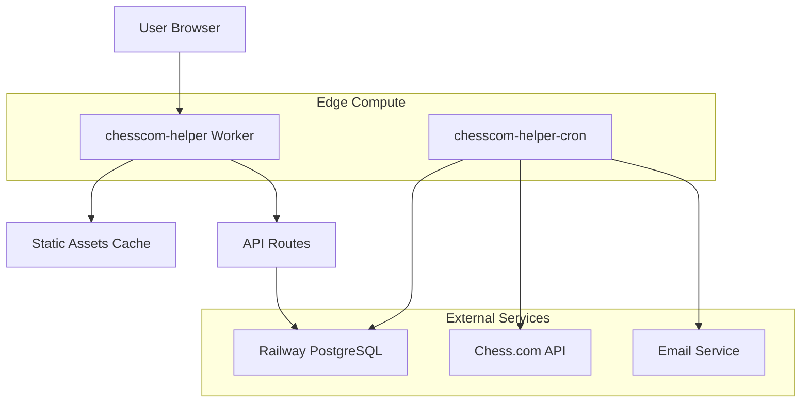

# 🏗️ Cloudflare Workers Deployment Architecture Plan
*Tailored for Claude Agent Implementation*

## 📋 Current State Analysis

**Existing Infrastructure:**
- ✅ **Main Worker**: `chesscom-helper` (serving the app)
- ✅ **Cron Worker**: `chesscom-helper-cron` (background tasks)
- ❌ **Missing**: `wrangler.toml` configuration files
- ❌ **Missing**: Source code for worker implementations
- ✅ **Source**: Django/React monorepo structure

**Project Structure Analysis:**
```
chesscom-helper/
├── chesscom_helper/           # Django backend
│   ├── frontend/             # React frontend (Vite)
│   ├── chesscom_app/         # Core app logic
│   ├── accounts/             # User management
│   └── config/               # Django settings
└── [MISSING] worker-src/     # Worker source code
```

## 🎯 Architecture Overview

### Target Worker Architecture


### Worker Responsibilities
1. **chesscom-helper**: Serves React frontend + API endpoints
2. **chesscom-helper-cron**: Background job processing (live match checking)

## 🔧 Technical Implementation Plan

### Phase 1: Reverse Engineer Current Workers

**Objective**: Recreate the source code and configuration for existing workers.

**Actions for Claude Agent:**

1. **Create worker source directories:**
```bash
mkdir -p worker-src/main-worker
mkdir -p worker-src/cron-worker
```

2. **Generate main worker structure:**
```javascript
// worker-src/main-worker/src/index.js
import { Router } from 'itty-router';
import { handleStatic } from './handlers/static';
import { handleAPI } from './handlers/api';
import { corsHeaders } from './utils/cors';

const router = Router();

// Serve static React files
router.get('/', handleStatic);
router.get('/static/*', handleStatic);
router.get('/assets/*', handleStatic);

// API routes
router.all('/api/*', handleAPI);

// Fallback to React app for SPA routing
router.get('*', handleStatic);

export default {
  async fetch(request, env, ctx) {
    return router.handle(request, env, ctx)
      .catch(err => new Response('Internal Error', { 
        status: 500,
        headers: corsHeaders(request)
      }));
  }
};
```

3. **Main worker configuration (`worker-src/main-worker/wrangler.toml`):**
```toml
name = "chesscom-helper"
main = "src/index.js"
compatibility_date = "2024-01-01"
compatibility_flags = ["nodejs_compat"]

[build]
command = "npm run build"

# Assets for React frontend
[assets]
bucket = "./dist"
include = ["**/*"]

# Environment variables
[vars]
CHESS_COM_API_BASE = "https://api.chess.com/pub"
FRONTEND_URL = "https://chesscom-helper.emily-flambe.workers.dev"

# Database connection (set as secret)
# DATABASE_URL will be configured separately

[triggers]
crons = []
```

4. **Generate cron worker structure:**
```javascript
// worker-src/cron-worker/src/index.js
import { checkLiveMatches } from './services/match-checker';
import { sendNotifications } from './services/notifications';

export default {
  async scheduled(event, env, ctx) {
    console.log('Cron trigger:', event.cron);
    
    try {
      const notifications = await checkLiveMatches(env);
      await sendNotifications(env, notifications);
      console.log(`Processed ${notifications.length} notifications`);
    } catch (error) {
      console.error('Cron job failed:', error);
      throw error;
    }
  },

  // Allow manual triggering
  async fetch(request, env, ctx) {
    if (request.method === 'POST' && new URL(request.url).pathname === '/trigger') {
      await this.scheduled({ cron: 'manual' }, env, ctx);
      return new Response('Triggered successfully');
    }
    return new Response('Cron Worker Active');
  }
};
```

5. **Cron worker configuration (`worker-src/cron-worker/wrangler.toml`):**
```toml
name = "chesscom-helper-cron"
main = "src/index.js"
compatibility_date = "2024-01-01"
compatibility_flags = ["nodejs_compat"]

# Run every 5 minutes
[triggers]
crons = ["*/5 * * * *"]

[vars]
CHESS_COM_API_BASE = "https://api.chess.com/pub"

# Secrets (set separately)
# DATABASE_URL
# EMAIL_API_KEY
# EMAIL_FROM_ADDRESS
```

### Phase 2: Frontend Build Integration

**Objective**: Bundle React frontend into worker-compatible static assets.

**Build Process:**

1. **Update frontend for worker deployment:**
```javascript
// chesscom_helper/frontend/vite.config.js
import { defineConfig } from 'vite'
import react from '@vitejs/plugin-react'

export default defineConfig({
  plugins: [react()],
  build: {
    outDir: '../../worker-src/main-worker/dist',
    emptyOutDir: true,
    assetsDir: 'assets',
    rollupOptions: {
      output: {
        manualChunks: undefined,
      },
    },
  },
  define: {
    'process.env.NODE_ENV': JSON.stringify(process.env.NODE_ENV || 'production'),
  },
  server: {
    proxy: {
      '/api': {
        target: 'http://localhost:8000',
        changeOrigin: true,
      }
    }
  }
})
```

2. **Create build script (`worker-src/main-worker/package.json`):**
```json
{
  "name": "chesscom-helper-worker",
  "version": "1.0.0",
  "scripts": {
    "build": "cd ../../chesscom_helper/frontend && npm run build",
    "deploy": "wrangler deploy",
    "dev": "wrangler dev",
    "build-and-deploy": "npm run build && npm run deploy"
  },
  "dependencies": {
    "itty-router": "^4.0.0",
    "postgres": "^3.4.0"
  },
  "devDependencies": {
    "wrangler": "^3.78.0"
  }
}
```

### Phase 3: API Layer Implementation

**Objective**: Convert Django REST API to Worker-compatible endpoints.

**Key Services to Implement:**

1. **Database Service (`worker-src/main-worker/src/services/database.js`):**
```javascript
import postgres from 'postgres';

export class DatabaseService {
  constructor(databaseUrl) {
    this.sql = postgres(databaseUrl);
  }

  async getUsers() {
    return await this.sql`
      SELECT player_id, username, name, is_playing, last_online
      FROM chesscom_app_user 
      ORDER BY username ASC
    `;
  }

  async addUser(userData) {
    return await this.sql`
      INSERT INTO chesscom_app_user ${this.sql(userData)}
      RETURNING *
    `;
  }

  async updateUserStatus(username, isPlaying) {
    return await this.sql`
      UPDATE chesscom_app_user 
      SET is_playing = ${isPlaying}, last_online = NOW()
      WHERE username = ${username}
    `;
  }

  async getSubscriptions(username) {
    return await this.sql`
      SELECT es.* FROM chesscom_app_emailsubscription es
      JOIN chesscom_app_user u ON es.player_id = u.player_id
      WHERE u.username = ${username} AND es.is_active = true
    `;
  }

  async close() {
    await this.sql.end();
  }
}
```

2. **API Handler (`worker-src/main-worker/src/handlers/api.js`):**
```javascript
import { Router } from 'itty-router';
import { DatabaseService } from '../services/database';
import { corsHeaders } from '../utils/cors';

const apiRouter = Router({ base: '/api' });

apiRouter.options('*', () => new Response(null, { 
  status: 204, 
  headers: corsHeaders() 
}));

apiRouter.get('/users', async (request, env) => {
  const db = new DatabaseService(env.DATABASE_URL);
  try {
    const users = await db.getUsers();
    return Response.json(users, { headers: corsHeaders() });
  } finally {
    await db.close();
  }
});

apiRouter.post('/users', async (request, env) => {
  const db = new DatabaseService(env.DATABASE_URL);
  try {
    const userData = await request.json();
    const user = await db.addUser(userData);
    return Response.json(user, { 
      status: 201, 
      headers: corsHeaders() 
    });
  } finally {
    await db.close();
  }
});

export const handleAPI = apiRouter.handle;
```

3. **Static File Handler (`worker-src/main-worker/src/handlers/static.js`):**
```javascript
export async function handleStatic(request, env) {
  const url = new URL(request.url);
  let pathname = url.pathname;

  // Default to index.html for SPA routing
  if (pathname === '/' || !pathname.includes('.')) {
    pathname = '/index.html';
  }

  // Remove leading slash for asset lookup
  const assetKey = pathname.replace(/^\//, '');
  
  // Get asset from Worker's bundled assets
  const asset = await env.ASSETS.fetch(`https://placeholder.com/${assetKey}`);
  
  if (asset.status === 404) {
    // Fallback to index.html for SPA routing
    return await env.ASSETS.fetch('https://placeholder.com/index.html');
  }

  return asset;
}
```

### Phase 4: Background Job Implementation

**Objective**: Implement live match checking and email notifications.

**Cron Worker Services:**

1. **Match Checker (`worker-src/cron-worker/src/services/match-checker.js`):**
```javascript
import { DatabaseService } from './database';

export async function checkLiveMatches(env) {
  const db = new DatabaseService(env.DATABASE_URL);
  const notifications = [];

  try {
    const users = await db.getUsers();
    
    for (const user of users) {
      const isCurrentlyPlaying = await checkChessComAPI(user.username);
      
      // User started playing (transition from false to true)
      if (isCurrentlyPlaying && !user.is_playing) {
        const subscriptions = await db.getSubscriptions(user.username);
        notifications.push(...subscriptions.map(sub => ({
          email: sub.email,
          username: user.username,
          subscriptionId: sub.id
        })));
      }
      
      // Update user status
      await db.updateUserStatus(user.username, isCurrentlyPlaying);
    }
  } finally {
    await db.close();
  }

  return notifications;
}

async function checkChessComAPI(username) {
  try {
    const response = await fetch(`https://api.chess.com/pub/player/${username}/games/to-move`);
    if (!response.ok) return false;
    
    const data = await response.json();
    return data.games && data.games.length > 0;
  } catch (error) {
    console.error(`Error checking ${username}:`, error);
    return false;
  }
}
```

2. **Email Service (`worker-src/cron-worker/src/services/notifications.js`):**
```javascript
export async function sendNotifications(env, notifications) {
  const results = [];
  
  for (const notification of notifications) {
    try {
      await sendEmail(env, notification);
      await logNotification(env, notification, 'sent');
      results.push({ ...notification, status: 'sent' });
    } catch (error) {
      await logNotification(env, notification, 'failed', error.message);
      results.push({ ...notification, status: 'failed', error: error.message });
    }
  }
  
  return results;
}

async function sendEmail(env, { email, username }) {
  const emailData = {
    personalizations: [{
      to: [{ email }],
      subject: `🔴 ${username} is playing live on Chess.com!`
    }],
    from: { 
      email: env.EMAIL_FROM_ADDRESS, 
      name: 'Chess.com Helper' 
    },
    content: [{
      type: 'text/html',
      value: generateEmailHTML(username)
    }]
  };

  const response = await fetch('https://api.sendgrid.v3/mail/send', {
    method: 'POST',
    headers: {
      'Authorization': `Bearer ${env.EMAIL_API_KEY}`,
      'Content-Type': 'application/json'
    },
    body: JSON.stringify(emailData)
  });

  if (!response.ok) {
    const error = await response.text();
    throw new Error(`Email failed: ${response.status} ${error}`);
  }
}
```

### Phase 5: Deployment & Configuration

**Implementation Steps:**

1. **Initialize worker projects:**
```bash
cd worker-src/main-worker
npm init -y
npm install itty-router postgres
npm install -D wrangler

cd ../cron-worker
npm init -y
npm install postgres
npm install -D wrangler
```

2. **Set up secrets:**
```bash
# Main worker secrets
cd worker-src/main-worker
wrangler secret put DATABASE_URL

# Cron worker secrets
cd ../cron-worker
wrangler secret put DATABASE_URL
wrangler secret put EMAIL_API_KEY
wrangler secret put EMAIL_FROM_ADDRESS
```

3. **Deploy workers:**
```bash
# Deploy main worker
cd worker-src/main-worker
npm run build-and-deploy

# Deploy cron worker
cd ../cron-worker
wrangler deploy
```

### Phase 6: GitHub Actions Integration

**Automated Deployment Workflow (`.github/workflows/deploy-workers.yaml`):**

```yaml
name: Deploy Cloudflare Workers

on:
  push:
    branches: [ main ]
  workflow_dispatch:

jobs:
  deploy-main-worker:
    runs-on: ubuntu-latest
    steps:
      - uses: actions/checkout@v4
      
      - name: Setup Node.js
        uses: actions/setup-node@v4
        with:
          node-version: '20'
          cache: 'npm'
          cache-dependency-path: |
            chesscom_helper/frontend/package-lock.json
            worker-src/main-worker/package-lock.json
      
      - name: Install frontend dependencies
        run: |
          cd chesscom_helper/frontend
          npm ci
      
      - name: Install worker dependencies
        run: |
          cd worker-src/main-worker
          npm ci
      
      - name: Build and deploy main worker
        run: |
          cd worker-src/main-worker
          npm run build-and-deploy
        env:
          CLOUDFLARE_API_TOKEN: ${{ secrets.CLOUDFLARE_API_TOKEN }}

  deploy-cron-worker:
    runs-on: ubuntu-latest
    steps:
      - uses: actions/checkout@v4
      
      - name: Setup Node.js
        uses: actions/setup-node@v4
        with:
          node-version: '20'
          cache: 'npm'
          cache-dependency-path: worker-src/cron-worker/package-lock.json
      
      - name: Install dependencies
        run: |
          cd worker-src/cron-worker
          npm ci
      
      - name: Deploy cron worker
        run: |
          cd worker-src/cron-worker
          wrangler deploy
        env:
          CLOUDFLARE_API_TOKEN: ${{ secrets.CLOUDFLARE_API_TOKEN }}
```

## 🎯 Implementation Priority Queue

### High Priority (Immediate)
1. ✅ **Create worker source directories and basic structure**
2. ✅ **Generate wrangler.toml files for both workers**
3. ✅ **Implement basic static file serving for React frontend**
4. ✅ **Set up database connection service**

### Medium Priority (Week 1)
1. **Convert Django API endpoints to Worker API handlers**
2. **Implement cron job logic for live match checking**
3. **Set up email notification service**
4. **Configure worker secrets and environment variables**

### Low Priority (Week 2)
1. **Set up automated GitHub Actions deployment**
2. **Implement monitoring and logging**
3. **Add error handling and retry logic**
4. **Performance optimization and caching**

## ⚙️ Environment Configuration

**Required Secrets:**
- `DATABASE_URL`: PostgreSQL connection string
- `EMAIL_API_KEY`: SendGrid or similar email service API key
- `EMAIL_FROM_ADDRESS`: Verified sender email address
- `CLOUDFLARE_API_TOKEN`: For GitHub Actions deployment

**Environment Variables:**
- `CHESS_COM_API_BASE`: `https://api.chess.com/pub`
- `FRONTEND_URL`: Your worker domain

## 🔍 Success Criteria

**Main Worker (`chesscom-helper`):**
- ✅ Serves React frontend at root path
- ✅ Handles `/api/*` endpoints with database connectivity
- ✅ Proper CORS configuration
- ✅ Static asset caching

**Cron Worker (`chesscom-helper-cron`):**
- ✅ Runs every 5 minutes via cron trigger
- ✅ Checks Chess.com API for live games
- ✅ Sends email notifications for status changes
- ✅ Logs notification attempts to database

**Integration:**
- ✅ Automated deployment via GitHub Actions
- ✅ Proper error handling and logging
- ✅ Performance monitoring

This architecture plan provides the technical foundation for a Claude agent to systematically recreate and improve your Cloudflare Workers deployment while maintaining the existing functionality.